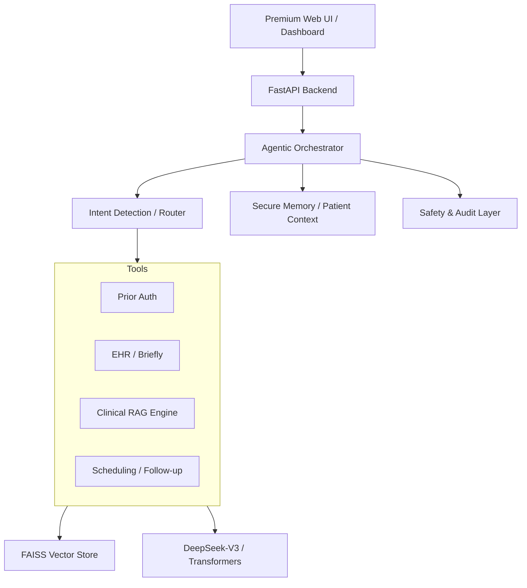

# Buddi Clinical Agent System

> **Healthcare Workflow Intelligence powered by Agentic AI**

Buddi Clinical Agent is an advanced, AI-driven clinical workflow system that automates healthcare administrative tasks, provides decision-critical clinical support, and orchestrates care activities across a distributed medical team. Built with a modular agentic architecture, it leverages Retrieval-Augmented Generation (RAG) to ground its responses in verified clinical guidelines.

## ✨ Premium Web Interface
Buddi features a state-of-the-art, healthcare-grade web terminal designed for high-stakes clinical environments:
- **🎛️ Multi-View Workspace**: Switch between Chat, **Risk Dashboard** (Heatmap), and **Shadow Mode** (Expert Comparison).
- **🧠 Perception Widget**: Siri-inspired integrated audio/screen capture for automated clinical note-taking and OCR.
- **💎 Glassmorphism Design**: High-premium teal-themed UI with responsive micro-animations and medical-grade aesthetics.
- **📊 Live Context Panel**: Real-time tracking of patient demographics, conditions, medications, and recent history.

## 🏥 Clinical Workflows

| Workflow | Description |
|----------|-------------|
| **Prior Authorization** | Automated form generation for Medicare, Medicaid, and Commercial insurance with intelligent clinical justification. |
| **Risk Dashboard** | A real-time heatmap of patient focus areas (A1C, BP, Adherence) and automated risk assessment. |
| **Shadow Mode** | Side-by-side comparison of AI suggestions against expert baselines for training and quality assurance. |
| **Patient Brief** | Pre-visit intelligence summarizing risks, missing labs, and suggested clinical questions based on EHR records. |
| **Clinical Guidelines** | RAG-powered mapping to ADA, ACC/AHA, GINA, and APA guidelines with structured treatment suggestions. |
| **Care Coordination** | coordinate labs, imaging, and referrals directly through the agentic interface. |
| **Safety Layer** | HIPAA-compliant audit logging with human-in-the-loop validation for all high-risk clinical actions. |

## 🏗 Modular Architecture



## 🚀 Quick Start

### 1. Install Dependencies
Ensure you have Python 3.11+ and Node.js for frontend assets (optional). Then run:

```bash
# Set up the isolated virtual environment
python3 -m venv venv
source venv/bin/activate

# Install core AI, web, and medical libraries
pip install -r requirements.txt

# macOS only: Install system dependencies for OCR and Audio
brew install tesseract portaudio ffmpeg faiss
```

### 2. Configure Environment
```bash
cp .env.example .env
# Edit .env and add your LLM API key
```

### 3. Run the System
Use the robust, isolated launcher to start both the FastAPI Backend and Web Server:
```bash
chmod +x run-web.sh
./run-web.sh
```
- **Web UI URL**: [http://localhost:3000](http://localhost:3000)
- **API Docs**: [http://localhost:8000/docs](http://localhost:8000/docs)

## 🔰 Environment Protection
Buddi includes a custom **Environment Guardian** in `./run-web.sh` that detects and bypasses corrupted system libraries (like `uvicorn` name conflicts) by prioritizing the project-local virtual environment and absolute pathing.

## ⚖️ Regulatory & Safety
- **Clinical Boundaries**: The system is hard-coded to block diagnosis or prescription actions.
- **Compliance**: HIPAA foundations are provided via an encrypted audit stream (`audit_log.json`).
- **Human-in-the-loop**: High-risk actions (Prior Auth, Referrals) require explicit human confirmation.

---
Buddi is a **Clinical Decision Support (CDS)** tool. It is not intended to replace professional medical judgment. 